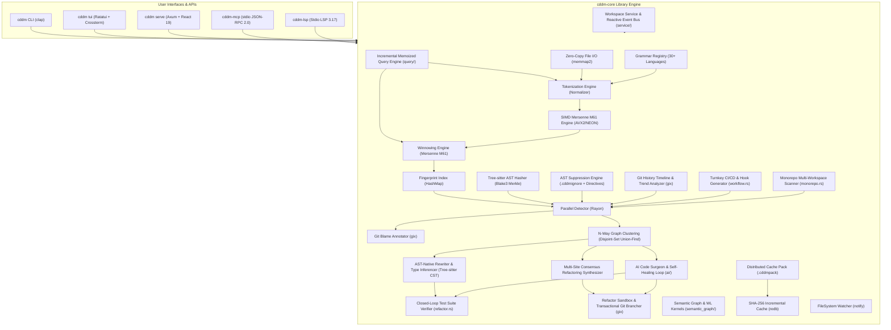
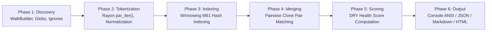
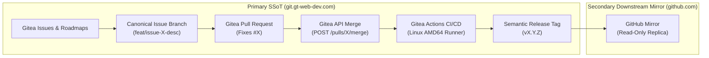

# CDDM — System Architecture

## 1. High-Level Architecture

CDDM (_Code De-Duplication Meister_) is a multi-threaded Rust workspace consisting of three primary crates, an embedded React 19 WebUI, and cross-platform npm/Cargo package wrappers:



---

## 2. Scan Execution Pipeline

The `run_scan()` function in `detector.rs` orchestrates the full code clone detection pipeline:



---

## 3. DRY Health Score Formula

CDDM measures overall codebase modularity and DRY health using a continuous non-linear scoring function:

```text
Score = max(0, min(100, (100 - 1.5 * Duplication_Percentage) * (1 - 0.25 * Cross_Module_Ratio)))
```

Where:

- **Duplication_Percentage**: Duplication percentage (`(Clone Tokens / Total Tokens) * 100`).
- **Cross_Module_Ratio**: Cross-module clone ratio (`Cross-Directory Clones / Total Clones`).

---

## 4. Winnowing Algorithm Parameters

The Winnowing fingerprinting engine uses Mersenne prime M61 = 2^61 - 1 for collision-resistant rolling hashing:

- **k-gram size**: `k = max(10, floor(min_tokens / 2))`
- **Window size**: `w = k + 5`
- **Hash bases**: `b1 = 313`, `b2 = 1000003` (dual-base hashing for collision resistance)
- **Rolling update**: `h_next = ((h_curr - old_token * b^(k-1)) * b + new_token) mod M61`

---

## 5. Crate Dependency Graph

```text
cddm-core (library crate)
  ├── blake3, sha2        (hashing)
  ├── rayon                (parallel CPU execution)
  ├── gix                  (in-process git blame)
  ├── ignore               (directory traversal & .gitignore parsing)
  ├── memmap2              (zero-copy memory-mapped file I/O)
  ├── tree-sitter-*        (AST CST parsing: 16 supported languages)
  ├── notify               (filesystem event watcher)
  ├── serde, serde_json    (serialization)
  └── tokio                (async runtime)

cddm-cli (binary crate) ──depends──→ cddm-core, cddm-lsp
  ├── clap                 (CLI flag parsing)
  ├── axum, tower-http     (HTTP server & static asset serving)
  ├── rust-embed           (static asset embedding)
  ├── comfy-table          (ANSI console tables)
  └── opener               (launching browser)

cddm-lsp (binary & library crate) ──depends──→ cddm-core
  ├── tower-lsp            (Language Server Protocol 3.17 implementation)
  ├── serde_json           (JSON-RPC 2.0 serialization)
  └── tokio                (async stdio transport)

cddm-mcp (binary crate) ──depends──→ cddm-core
  ├── serde_json           (JSON-RPC 2.0 serialization)
  └── tokio                (async stdio transport)
```

---

## 6. WebUI Embedding Architecture

The React 19 WebUI is compiled to static assets at build time (`vp run build` in `webui/`) and embedded directly into the compiled Rust binary:

```text
Build Time:                          Runtime:
┌────────────────┐                  ┌────────────────────────┐
│ webui/src/     │   vp run build   │ cddm-cli binary        │
│ ├── App.tsx    │ ──────────────→  │ ┌────────────────────┐ │
│ ├── store/     │ Vite Plus → dist │ │ rust-embed Assets  │ │
│ └── components/│                  │ │ ├── index.html     │ │
└────────────────┘                  │ │ └── assets/*.js    │ │
                                    │ └────────┬───────────┘ │
                                    │          │ Axum routes  │
                                    │ GET /*   → static_asset │
                                    │ GET /    → index.html   │
                                    │ POST /api/scan → run()  │
                                    │ GET /api/events → SSE   │
                                    │ POST /api/apply-patch   │
                                    │ GET /api/health → ok    │
                                    └────────────────────────┘
```

---

## 7. Distribution Architecture

CDDM supports dual distribution channels:

1. **Cargo Crates (`crates.io`)**:
   - `cddm-core`: Library crate published for Rust projects.
   - `cddm-cli`: Binary crate installed via `cargo install cddm`.
   - `cddm-mcp`: MCP stdio server binary.

2. **npm Registry (`npmjs.com`)**:
   - `cddm`: Universal npm wrapper package with platform binary shims (`bin/cddm.js`).
   - `@cddm/win32-x64`, `@cddm/linux-x64`, `@cddm/darwin-x64`, `@cddm/darwin-arm64`: Native pre-built release binaries.

3. **GitHub Actions CI/CD Workflows**:
   - `.github/workflows/ci.yml`: Matrix build testing (Ubuntu, Windows, macOS), `clippy`, `rustfmt`, and WebUI tests.
   - `.github/workflows/release.yml`: Cross-compiling standalone release binaries on GitHub tag pushes (`v*`).

---

## 8. WebUI Component Architecture (`Atomic UI` & `win2x-manager`)

The WebUI frontend is split into two clean architectural layers:

1. **Shared Atomic UI Library (`webui/src/components/ui/`)**:
   - **Atoms**: `Portal`, `Backdrop`, `Badge`, `IconButton`.
   - **Molecules**: `CollapsibleCard`, `CodeBlock`.
   - **Design Tokens**: Parameterized `--cddm-ui-*` CSS custom properties with zero magic literals.

2. **Universal Window Manager (`webui/src/components/ui/win2x-manager/`)**:
   - **Pure Engine**: Zero application-specific UI, framework-agnostic mathematical geometry engine (`geometry-engine.ts`), and W3C hardware pointer driver (`pointer-driver.ts`).
   - **Components**: `TitleBar`, `WindowControls`, `ResizeHandle`, `ResizeHandleGroup`, `Win2xWindow`.
   - **Design Tokens**: Parameterized `--win2x-*` custom properties with modern nested CSS scoping.
   - **Compositor Pipeline**: 120fps hardware-accelerated movement via `transform: translate3d(x, y, 0)`, dynamic blur decoupling on `[data-moving="true"]`, and CSS containment (`contain: layout paint`).

---

## 9. AI Agent Governance & Progressive Customizations (`Antigravity 2.0`)

To maintain pristine engineering standards and prevent context window degradation during AI pair programming:

1. **Root SSoT Index ([AGENTS.md](../AGENTS.md))**:
   - Lightweight index loaded unconditionally, pointing to modular rules and skills in `.agents/`.

2. **Progressive Customization Engine (`.agents/`)**:
   - **Modular Rules (`.agents/rules/`)**: Scoped `trigger: always_on` rule files for task completion workflow, file length limits, legacy remediation, and core coding standards.
   - **Workspace Skills (`.agents/skills/`)**: On-demand runbooks (`cddm-task-workflow`, `cddm-modular-refactoring`) activated by agent decision.

3. **Automated Quality Gate (`scripts/verify.ts`)**:
   - Dynamically executes all verification checks (Rust, TypeScript, Vitest, documentation integrity, file length caps, dogfooding self-scan) with zero hardcoded step counts.

---

## 10. Polyglot Testing Architecture

CDDM maintains a multi-tier, zero-orphan testing architecture across all interaction pillars and languages:

1. **Rust Engine & Crates**: Co-located module unit tests (`#[cfg(test)] mod tests` / sibling `tests.rs` submodules) and black-box integration suites (`crates/<crate>/tests/`).
2. **WebUI Studio**: Co-located component, hook, store, and utility test suites (`*.test.tsx`, `*.test.ts`) powered by Vitest and React Testing Library.
3. **Workspace Scripts**: Co-located library unit tests (`scripts/lib/*.test.ts`) and functional script CLI execution suites (`scripts/tests/*.test.ts`).
4. **MCP Protocol & Tools**: 1:1 isolated tool test suites (`tests/mcp/tools/*.test.ts`) with dynamic runtime discovery (`tests/mcp/discovery.test.ts`).

For detailed architectural guidelines and conventions, see [Testing Architecture (docs/TESTING.md)](TESTING.md) and [.agents/rules/test.md](../.agents/rules/test.md).

---

## 11. Domain Service & Incremental Query Architecture

To ensure high-throughput execution, real-time live watch subscriptions, and clean decoupling across all interface adapters:

1. **Unified Workspace Service (`cddm-core::service`)**:
   - `WorkspaceService`: Coordinates multi-phase scans, cancellations, background session tracking, and dry health metrics.
   - `EventBus`: High-throughput reactive broadcast channel (`tokio::sync::broadcast`) for streaming scan phase updates, file watch deltas, and refactoring lifecycle events to WebUI SSE, MCP notifications, and TUI screens.
   - `SessionManager`: Manages execution lifecycles, atomic cancellation flags, and state snapshots.

2. **Incremental Query Engine (`cddm-core::query`)**:
   - `IncrementalQueryEngine`: Query-memoized computation engine providing sub-millisecond tokenization and Winnowing fingerprinting.
   - `QueryMemoCache`: Thread-safe in-memory cache keyed by `QueryKey(file_path, content_blake3_hash)` with early cutoff for unmodified files.
   - `IncrementalDeltaReport`: Fine-grained snapshot diff reporting across repository revisions.

---

## 12. Modern Core Engine & Protocol Capabilities (2026 Standards)

1. **Tree-Sitter Incremental Delta Parsing (`cddm-core::ast`)**:
   - Reuses existing CST subtrees using `tree_sitter::InputEdit` byte/row coordinate offsets, achieving sub-millisecond re-parsing on single-file code edits.

2. **Pure-Rust HNSW Multi-Layer Vector Index (`cddm-core::neural::hnsw`)**:
   - High-speed $O(N \log N)$ indexing and $O(\log N)$ approximate nearest neighbor cosine search for dense code embeddings across multi-language codebases.

3. **Strongly-Typed Domain Error Hierarchy (`cddm-core::error`)**:
   - Comprehensive domain error taxonomy with `thiserror`, separating scan, parse, refactoring, policy violation, cache, and neural errors.

4. **LSP 3.18 CodeLens & Inlay Hints (`cddm-lsp`)**:
   - Interactive code lenses for clone counterpart navigation and non-intrusive inline clone percentage badges.

5. **MCP 2026 Agentic Sampling Protocol (`cddm-mcp`)**:
   - Sampling elicitation (`sampling/createMessage`) enabling AI coding assistants to leverage server-side reasoning loops.

---

## 13. Single Source of Truth (SSoT), Release Management & CI/CD Topology

CDDM enforces an authoritative governance architecture separating primary repository operations from downstream distribution mirrors:



1. **Primary SSoT (Gitea)**: Authoritative repository for issue tracking, milestones, PRs, reviews, and primary binary packaging.
2. **Automated API-Driven Merges**: Pull requests are merged exclusively via the Gitea REST API, ensuring PRs are marked `merged: true`, closed in the UI, and linked issues are automatically resolved.
3. **Automated Multi-Manifest Release Pipeline**: `vp run version:release` synchronizes all 10 manifests (`package.json`, `Cargo.toml`, `webui/package.json`, NPM packages, VS Code extension, Homebrew, Scoop, Winget, and README badges) and triggers cross-compilation for Linux AMD64 and Windows x86_64 binaries.
4. **Downstream Mirroring**: Commits, tags, and assets are synchronized downstream to GitHub.
