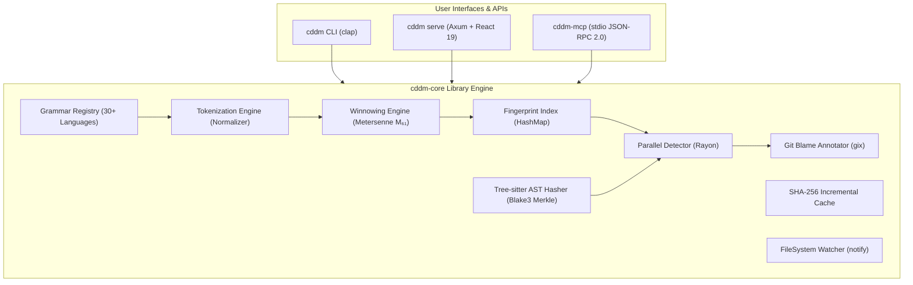
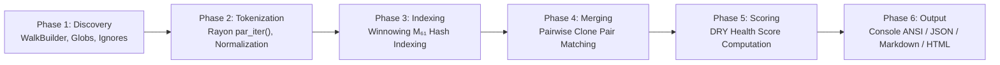

# CDDM — System Architecture

## 1. High-Level Architecture

CDDM (*Code De-Duplication Meister*) is a multi-threaded Rust workspace consisting of three primary crates, an embedded React 19 WebUI, and cross-platform npm/Cargo package wrappers:



---

## 2. Scan Execution Pipeline

The `run_scan()` function in `detector.rs` orchestrates the full code clone detection pipeline:



---

## 3. DRY Health Score Formula

CDDM measures overall codebase modularity and DRY health using a continuous non-linear scoring function:

$$S_{\text{DRY}} = \max\!\bigl(0,\; \min\!\bigl(100,\; (100 - 1.5 \cdot D_\%) \cdot (1 - 0.25 \cdot R_{\text{cross}})\bigr)\bigr)$$

Where:
- **$D_\%$**: Duplication percentage ($\frac{\text{Clone Tokens}}{\text{Total Tokens}} \times 100$).
- **$R_{\text{cross}}$**: Cross-module clone ratio ($\frac{\text{Cross-Directory Clones}}{\text{Total Clones}}$).

---

## 4. Winnowing Algorithm Parameters

The Winnowing fingerprinting engine uses Mersenne prime $M_{61} = 2^{61} - 1$ for collision-resistant rolling hashing:

- **k-gram size**: $k = \max(10, \lfloor \text{min\_tokens} / 2 \rfloor)$
- **Window size**: $w = k + 5$
- **Hash bases**: $b_1 = 313$, $b_2 = 1{,}000{,}003$ (dual-base hashing for collision resistance)
- **Rolling update**: $h' = ((h - \text{old} \cdot b^{k-1}) \cdot b + \text{new}) \bmod M_{61}$

---

## 5. Crate Dependency Graph

```text
cddm-core (library crate)
  ├── blake3, sha2        (hashing)
  ├── rayon                (parallel CPU execution)
  ├── gix                  (in-process git blame)
  ├── ignore               (directory traversal & .gitignore parsing)
  ├── tree-sitter-*        (AST CST parsing: Rust, TS, JS, Python)
  ├── notify               (filesystem event watcher)
  ├── serde, serde_json    (serialization)
  └── tokio                (async runtime)

cddm-cli (binary crate) ──depends──→ cddm-core
  ├── clap                 (CLI flag parsing)
  ├── axum, tower-http     (HTTP server & static asset serving)
  ├── rust-embed           (embedding dist/ static WebUI files)
  ├── comfy-table          (ANSI console tables)
  └── opener               (launching system browser)

cddm-mcp (binary crate) ──depends──→ cddm-core
  ├── serde_json           (JSON-RPC 2.0 serialization)
  └── tokio                (async stdio transport)
```

---

## 6. WebUI Embedding Architecture

The React 19 WebUI is compiled to static assets at build time (`bun run build` in `webui/`) and embedded directly into the compiled Rust binary:

```text
Build Time:                          Runtime:
┌────────────────┐                  ┌────────────────────────┐
│ webui/src/     │  bun run build   │ cddm-cli binary        │
│ ├── App.tsx    │ ──────────────→  │ ┌────────────────────┐ │
│ ├── store/     │   Vite → dist/   │ │ rust-embed Assets  │ │
│ └── components/│                  │ │ ├── index.html     │ │
└────────────────┘                  │ │ └── assets/*.js    │ │
                                    │ └────────┬───────────┘ │
                                    │          │ Axum routes  │
                                    │ GET /*  → static_asset  │
                                    │ GET /   → index.html    │
                                    │ POST /api/scan → run()  │
                                    │ GET /api/health → ok    │
                                    └────────────────────────┘
```

---

## 7. Distribution Architecture

CDDM supports dual distribution channels:

1. **Cargo Crates (`crates.io`)**:
   - `cddm-core`: Library crate published for Rust projects.
   - `cddm-cli`: Binary crate installed via `cargo install cddm`.
   - `cddm-mcp`: MCP stdio server binary.

2. **npm Registry (`npmjs.com`)**:
   - `cddm`: Universal npm wrapper package with platform binary shims (`bin/cddm.js`).
   - `@cddm/win32-x64`, `@cddm/linux-x64`, `@cddm/darwin-x64`, `@cddm/darwin-arm64`: Native pre-built release binaries.

3. **GitHub Actions CI/CD Workflows**:
   - `.github/workflows/ci.yml`: Matrix build testing (Ubuntu, Windows, macOS), `clippy`, `rustfmt`, and WebUI tests.
   - `.github/workflows/release.yml`: Cross-compiling standalone release binaries on GitHub tag pushes (`v*`).
